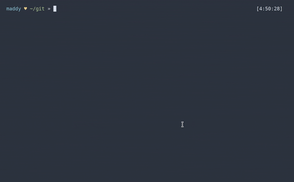

### suto-prompt.plugin.zsh

ZSH plugin for displaying your current sudo timeout status

### Example


### Usage
In your `.zshrc`, include `suto-prompt` in your `plugins` array:

```shell
plugins=(
  suto-prompt
)
```

In your `.zsh-theme`, pass `_suto_prompt` two strings to display for `suto` statuses of 0 and 1, respectively:

```shell
PROMPT='%{$fg_no_bold[cyan]%}%n $(_suto_prompt "%{$fg_no_bold[red]%}♥" "%{$fg_no_bold[yellow]%}♥") %{$fg_no_bold[green]%}%3~$(git_prompt_info)%{$reset_color%} » '
```

#### See Also:
[suto](https://github.com/b0o/suto)

